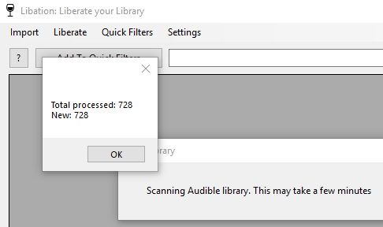
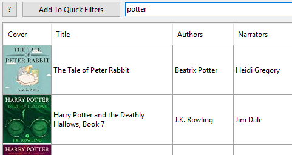

# Libation: Liberate your Library

# Table of Contents

1. [Audible audiobook manager](#audible-audiobook-manager)
    - [The good](#the-good)
    - [The bad](#the-bad)
    - [The ugly](#the-ugly)
2. [Getting started](#getting-started)
    - [Import your library](#import-your-library)
    - [Download your books -- DRM-free!](#download-your-books----drm-free)
    - [Download PDF attachments](#download-pdf-attachments)
    - [Details of downloaded files](#details-of-downloaded-files)
3. [Searching and filtering](#searching-and-filtering)
    - [Tags](#tags)
    - [Searches](#searches)
    - [Search examples](#search-examples)
    - [Filters](#filters)

## Audible audiobook manager

### The good

* Import library from audible, including cover art
* Download and remove DRM from all books
* Download accompanying PDFs
* Add tags to books for better organization
* Powerful advanced search built on the Lucene search engine
* Customizable saved filters for common searches
* Open source
* Tested on US Audible only. Should theoretically also work for Canada, UK, Germany, and France

<a name="theBad"/>

### The bad

* Windows only
* Several known speed/performance issues
* Large file size
* Made by a programmer, not a designer so the goals are function rather than beauty. And it shows

### The ugly

* Documentation? Yer lookin' at it
* This is a single-developer personal passion project. Support, response, updates, enhancements, bug fixes etc are as my free time allows
* I have a full-time job, a life, and a finite attention span. Therefore a lot of time can potentially go by with no improvements of any kind

Disclaimer: I've made every good-faith effort to include nothing insecure, malicious, anti-privacy, or destructive. That said: use at your own risk.

I made this for myself and I want to share it with the great programming and audible/audiobook communiites which have been so generous with their time and help.

## Getting started

### Import your library

Select Import > Scan Library:

You'll see this window while it's scanning:

Success! We see how many new titles are imported:

### Download your books -- DRM-free!

Automatically download some or all of your audible books. This shows you how much of your library is not yet downloaded and decrypted:

Select Liberate > Begin Book Backups

You can also click on the stop light to download only that title and its PDF

First the original book with DRM is downloaded

Then it's decrypted so you can use it on any device you choose. The very first time you decrypt a book, this step will take a while. Every other book will go much faster. The first time, Libation has to figure out the special decryption key which allows your personal books to be unlocked.

And voila! If you have multiple books not yet liberated, Libation will automatically move on to the next.

### Download PDF attachments

For books which include PDF downloads, Libation can download these for you as well and will attempt to store them with the book. "Book backup" will already download an available PDF. This additional option is useful when Audible adds a PDF to your book after you've already backed it up.

Select Liberate > Begin PDF Backups

The downloads work just like with books, only with no additional decryption needed.

### Details of downloaded files

When you set up Libation, you'll specify a Books directory. Libation looks inside that directory and all subdirectories to look for files or folders with each library book's audible id. This way, organization is completely up to you. When you download + decrypt a book, you get several files

* .m4b: your audiobook in m4b format. This is the most pure version of your audiobook and retains the highest quality. Now that it's decrypted, you can play it on any audio player and put it on any device. If you'd like, you can also use 3rd party tools to turn it into an mp3. The freedom to do what you want with your files was the original inspiration for Libation.
* .cue: this is a file which logs where chapter breaks occur. Many tools are able to use this if you want to split your book into files along chapter lines.
* .nfo: This is just some general info about the book and includes some technical stats about the audiofile.

## Searching and filtering

### Tags

To add tags to a title, click the tags button

Add as many tags as you'd like. Tags are separated by a space. Each tag can contain letters, numbers, and underscores

Tags are saved non-case specific for easy search. There is one special tag "hidden" which will also grey-out the book

To edit tags, just click the button again.

### Searches

Libation's advanced searching is built on the powerful Lucene search engine. Simple searches are effortless and powerful searches are simple. To search, just type and click Filter or press enter

* Type anything in the search box to search common fields: title, authors, narrators, and the book's audible id
* Use Lucene's "Query Parser Syntax" for advanced searching.
    * Easy tutorial: http://www.lucenetutorial.com/lucene-query-syntax.html
    * Full official guide: https://lucene.apache.org/core/2_9_4/queryparsersyntax.html
* Tons of search fields, specific to audiobooks
* Synonyms so you don't have to memorize magic words. Eg: author and author**s** will both work
* Click [?] button for a full list of search fields and synonyms 
* Search by tag like \[this\]
* When tags have an underscore you can use part of the tag. This is useful for quick categories. The below examples make this more clear.

### Search examples

Search for anything with the word potter

If you only want to see Harry Potter

If you only want to see potter except for Harry Potter

Can also use "-" instead of "NOT"

To see only books written by Neil Gaiman where he also narrates his own book. (If you don't include AND, you'll see everything written by Neil Gaiman and also all books in your library which are self-narrated.)

I tagged autobiographies as auto_bio and biographies written by someone else as bio. I can get only autobiographies with \[auto_bio\] or get both by searching \[bio\]

![Search example: \[bio\]](images/SearchExampleBio.png)
![Search example: \[auto_bio\]](images/SearchExampleAutoBio.png)

### Filters

If you have a search you want to save, click Add To Quick Filters to save it in your Quick Filters list. To use it again, select it from the Quick Filters list.

To edit this list go to Quick Filters > Edit quick filters. Here you can re-order the list, delete filters, double-click a filter to edit it, or double-click the bottom blank box to add a new filter.

Check "Quick Filters > Start Libation with 1st filter Default" to have your top filter automatically applied when Libation starts. In this top example, I want to always start without these: at books I've tagged hidden, books I've tagged as free_audible_originals, and books which I have rated.

