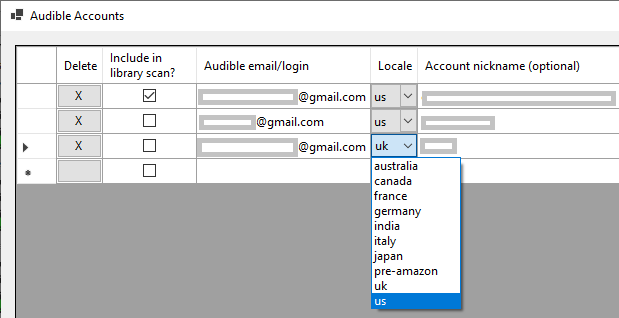
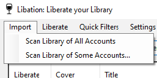

# Libation: Liberate your Library

## [Download Libation](https://github.com/rmcrackan/Libation/releases/latest)

### If you found this useful, tell a friend. If you found this REALLY useful, you can click here to [PalPal.me](https://paypal.me/mcrackan?locale.x=en_us)
...or just tell more friends. As long as I'm maintaining this software, it will remain **free** and **open source**.

# Table of Contents

- [Audible audiobook manager](#audible-audiobook-manager)
    - [The good](#the-good)
    - [The bad](#the-bad)
    - [The ugly](#the-ugly)
- [Getting started](Documentation/GettingStarted.md#getting-started)
    - [Download Libation](Documentation/GettingStarted.md#download-libation-1)
    - [Installation](Documentation/GettingStarted.md#installation)
    - [Create Accounts](Documentation/GettingStarted.md#create-accounts)
    - [Import your library](Documentation/GettingStarted.md#import-your-library)
    - [Download your books -- DRM-free!](Documentation/GettingStarted.md#download-your-books----drm-free)
    - [Download PDF attachments](Documentation/GettingStarted.md#download-pdf-attachments)
    - [Details of downloaded files](Documentation/GettingStarted.md#details-of-downloaded-files)
    - [Export your library](Documentation/GettingStarted.md#export-your-library)
- [Searching and filtering](Documentation/SearchingAndFiltering.md)
    - [Tags](Documentation/SearchingAndFiltering.md#tags)
    - [Searches](Documentation/SearchingAndFiltering.md#searches)
    - [Search examples](Documentation/SearchingAndFiltering.md#search-examples)
    - [Filters](Documentation/SearchingAndFiltering.md#filters)
- [Advanced](Documentation/Advanced.md)
    - [Files and folders](Documentation/Advanced.md#files-and-folders)
    - [Linux and Mac (unofficial)](Documentation/Advanced.md#linux-and-mac)
    - [Settings](Documentation/Advanced.md#settings)
    - [Custom File Naming](Documentation/Advanced.md#custom-file-naming)
    - [Command Line Interface](Documentation/Advanced.md#command-line-interface)

## Audible audiobook manager

### The good

* Import library from audible, including cover art
* Download and remove DRM from all books
* Download accompanying PDFs
* Add tags to books for better organization
* Powerful advanced search built on the Lucene search engine
* Customizable saved filters for common searches
* Open source
* Supports most regions: US, UK, Canada, Germany, France, Australia, Japan, India, and Spain

<a name="theBad"/>

### The bad

* Windows only
* Several known speed/performance issues
* Large file size
* Made by a programmer, not a designer so the goals are function rather than beauty. And it shows

### The ugly

* Documentation? Yer lookin' at it
* This is a single-developer personal passion project. Support, response, updates, enhancements, bug fixes etc are as my free time allows
* I have a full-time job, a life, and a finite attention span. Therefore a lot of time can potentially go by with no improvements of any kind

Disclaimer: I've made every good-faith effort to include nothing insecure, malicious, anti-privacy, or destructive. That said: use at your own risk.

I made this for myself and I want to share it with the great programming and audible/audiobook communiites which have been so generous with their time and help.

## Getting started

### [Download Libation](https://github.com/rmcrackan/Libation/releases)

### Installation

To install Libation, extract the zip file to a folder, for example `C:\Libation`, and then run Libation.exe from that folder to begin the configuration process and configure your account(s).

### Create Accounts

Create your account(s):

New locale options include many more regions including old audible accounts which pre-date the amazon acquisition

### Import your library

Select Import > Scan Library:

Or if you have multiple accounts, you'll get to choose whether to scan all accounts or just the ones you select:

If this is a new installation, or you're scanning an account you haven't scanned before, you'll be prompted to enter your password for the Audible account.

Enter the password and click Submit. Audible will prompt you with a CAPTCHA image. 

Enter the CAPTCHA answer characters and click Submit. If all has gone well, Libation will start scanning the account. 

In rare instances, the Captcha image/response will fail in an endless loop. If this happens, delete the problem account, and then click Save. Re-add the account and click Save again. Now try to scan the account again. This time, instead of typing your password, click the link that says "Or click here". This will open the Audible External Login dialog shown below.

You can either copy the URL shown and paste it into your browser or launch the browser directly by clicking Launch in Browser. Audible will display its standard login page. Login, including answering the CAPTCHA on the next page. In some cases, you might have to approve the login from the email account associated with that login, but once the login is successful, you'll see an error message.

This actually means you've successfully logged in. Copy the entire URL shown in your browser and return to Libation. Paste that URL into the text box at the bottom of the Audible External Login window and click Submit.

You'll see this window while it's scanning:

Success! We see how many new titles are imported:

### Download your books -- DRM-free!

Automatically download some or all of your audible books. This shows you how much of your library is not yet downloaded and decrypted:

The stoplights will tell you a title's status:

* Green: downloaded and decrypted
* Yellow: downloaded but still encrypted with DRM
* Red: not downloaded
* PDF icon without arrow: downloaded
* PDF with arrow: not downloaded

Or hover over the button to see the status.

Select Liberate > Begin Book Backups

You can also click on the stop light to download only that title and its PDF

First the original book with DRM is downloaded

Then it's decrypted so you can use it on any device you choose. The very first time you decrypt a book, this step will take a while. Every other book will go much faster. The first time, Libation has to figure out the special decryption key which allows your personal books to be unlocked.

And voila! If you have multiple books not yet liberated, Libation will automatically move on to the next.

The Audible id must be somewhere in the book's file or folder name for Libation to detect your downloaded book.

### Download PDF attachments

For books which include PDF downloads, Libation can download these for you as well and will attempt to store them with the book. "Book backup" will already download an available PDF. This additional option is useful when Audible adds a PDF to your book after you've already backed it up.

Select Liberate > Begin PDF Backups

The downloads work just like with books, only with no additional decryption needed.

### Details of downloaded files

When you set up Libation, you'll specify a Books directory. Libation looks inside that directory and all subdirectories to look for files or folders with each library book's audible id. This way, organization is completely up to you. When you download + decrypt a book, you get several files

* .m4b: your audiobook in m4b format. This is the most pure version of your audiobook and retains the highest quality. Now that it's decrypted, you can play it on any audio player and put it on any device. If you'd like, you can also use 3rd party tools to turn it into an mp3. The freedom to do what you want with your files was the original inspiration for Libation.
* .cue: this is a file which logs where chapter breaks occur. Many tools are able to use this if you want to split your book into files along chapter lines.

### Export your library

Export your library to Excel, CSV, or JSON
